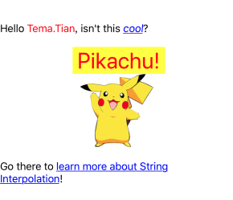

# TTText

Swift 5 string interpolation - NSAttributedString


  


## CocoaPods

CocoaPods is a dependency manager for Cocoa projects. You can install it with the following command:

```
$ gem install cocoapods
```
To integrate TTText into your Xcode project using CocoaPods, specify it in your Podfile:

```
source 'https://github.com/CocoaPods/Specs.git'
platform :ios, '9.0'
use_frameworks!

target '<Your Target Name>' do
    pod 'TTText'
end
```
Then, run the following command:
```
pod install
```

## Example


    let username = "Tema.Tian"
    
    let str: TTText = """
    Hello \(username, .color(.red)), isn't this \("cool", .color(.blue), .oblique, .underline(.purple, .single))?
    
    \(wrap: """
    \(" Pikachu! ", .font(.systemFont(ofSize: 36)), .color(.red), .bgColor(.yellow))
    \(image: #imageLiteral(resourceName: "pikachu"))
    """, .alignment(.center))
    
    Go there to \("learn more about String Interpolation", .link("https://github.com/apple/swift-evolution/blob/master/proposals/0228-fix-expressiblebystringinterpolation.md"), .underline(.blue, .single))!
    """
    
    label.attributedText = str.attributedString

Or

    label.attributedText = attributedText(
    """
    Hello \(username, .color(.red)), isn't this \("cool", .color(.blue), .oblique, .underline(.purple, .single))?
    
    \(wrap: """
    \(" Pikachu! ", .font(.systemFont(ofSize: 36)), .color(.red), .bgColor(.yellow))
    \(image: #imageLiteral(resourceName: "pikachu"))
    """, .alignment(.center))
    
    Go there to \("learn more about String Interpolation", .link("https://github.com/apple/swift-evolution/blob/master/proposals/0228-fix-expressiblebystringinterpolation.md"), .underline(.blue, .single))!
    """)
